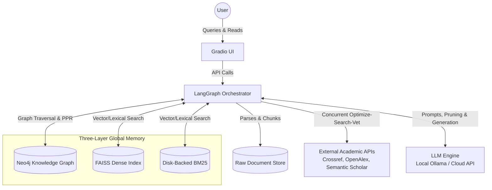
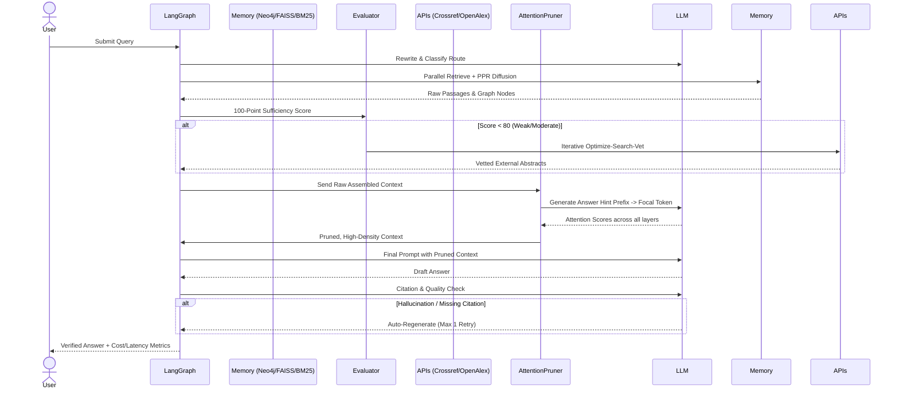
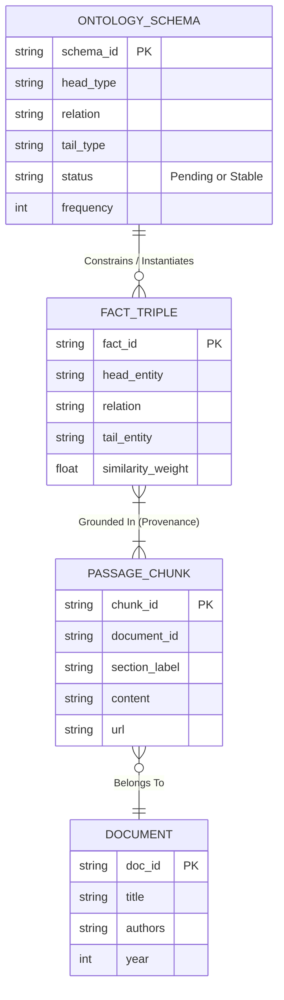
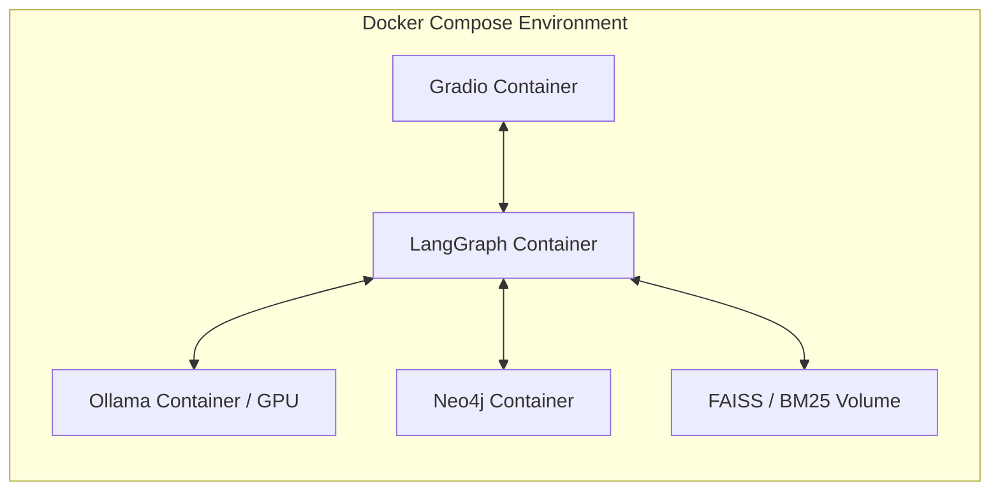

# Software Design Document (SDD)

**Project Name**: Project Aletheia (Agentic Memory-Guided AI Tracker)
**Version**: 2.1 (Architecturally Refined & Integrated Architecture)

## 1. Introduction

**Purpose**: This document defines the software architecture, system components, and data flow for Project Aletheia. It serves as the primary blueprint for the engineering team to build, maintain, and scale the system.

**Scope**: The system encompasses an offline ingestion pipeline for parsing academic PDFs, a Three-Layer Global Memory architecture (Neo4j, FAISS, Disk-Backed BM25), a multi-agent orchestration layer (LangGraph), an attention-guided context compressor, and a web-based conversational interface (Gradio). Multimodal data extraction (e.g., images/charts) and local model training are out of scope.

**Definitions and Acronyms**:

- **PRD**: Product Requirements Document
- **PPR**: Personalized PageRank (Graph traversal algorithm)
- **FAISS**: Facebook AI Similarity Search (Dense vector index)
- **BM25**: Best Matching 25 (Sparse lexical index - implemented via persistent disk-serialization)
- **Focal Token**: The single target token generated by an "answer hint prefix" used to calculate attention scores for context pruning.
- **Micro-Window**: A localized 50–300 token segment created dynamically from larger layout chunks to prevent attention dilution.

**References**: Project Aletheia PRD (Finalized Draft).

## 2. System Overview

**System Description**: Project Aletheia is an autonomous conversational AI system that tracks and explains AI advancements. It utilizes a collaborative multi-agent society and a global memory structure to eliminate hallucination, logical inconsistency, and structural fragmentation, followed by a dynamic attention-based pruning step to compress context before generation.

**Design Goals**:

- **Accuracy & Traceability**: Target $\ge 80\%$ citation grounding and factual accuracy for all generated claims.
- **Autonomy**: Capable of independent external academic research when local evidence is scored as weak.
- **Efficiency**: Compress retrieved contexts by up to 6.3x to prevent attention dilution and reduce token overhead.
- **Privacy/Flexibility**: Support local inference endpoints (e.g., Ollama running Qwen) to handle proprietary data securely.

**Architecture Summary**: A microservice-inspired architecture orchestrated by LangGraph. It relies on a heterogeneous data layer (Neo4j, FAISS, Persistent BM25) and integrates external academic APIs concurrently for fallback research.

**System Context Diagram**:



## 3. Architectural Design

**System Architecture Diagram**:

```mermaid
graph TD
    subgraph UI Layer
        UI[Gradio Interface]
    end

    subgraph Online Orchestration (LangGraph)
        Router[Query Router]
        Retriever[Memory-Guided Retriever]
        Eval[Evidence Evaluator & Scorer]
        ExtSearch[Async External Search Agent]
        Pruner[Attention-Guided Context Compressor]
        Gen[Generator & Critic]
    end

    subgraph Offline Ingestion (Multi-Agent Sandbox)
        PDF[PyMuPDF Parser]
        Ext[Extraction Agent]
        Detect[Conflict Detection Agent]
        Resolve[Conflict Resolution Agent]
        PDF --> Ext --> Detect <--> Resolve
    end

    subgraph Storage
        Graph[(Neo4j: Ontology, Fact, Passage)]
        Dense[(FAISS)]
        Sparse[(Serialized/Persistent BM25)]
    end

    UI --> Router
    Resolve --> Graph & Dense & Sparse
    Router --> Retriever
    Retriever --> Graph & Dense & Sparse
    Graph & Dense & Sparse --> Eval
    Eval -->|Score < 80| ExtSearch
    ExtSearch --> Pruner
    Eval -->|Score >= 80| Pruner
    Pruner --> Gen
    Gen -->|Citation/Quality Check| UI
```

**Component Breakdown**:

- **Offline Ingestion Sandbox**: An isolated multi-agent loop that parses PDFs, extracts facts, detects conflicts (temporal, granular, mutual exclusivity), and resolves them against raw passages before writing to the global memory.
- **Online Orchestration**: The LangGraph state machine. Manages routing (Content, Bibliometric, Trend), parallel retrieval, 100-point evidence scoring, and the external API fallback loop.
- **Attention Compressor**: Dynamically prunes the assembled context.
- **Storage**: Neo4j (Graph), FAISS (Dense), BM25 (Sparse).
- **Technology Stack**: Python, LangGraph, Neo4j, FAISS, rank_bm25, PyMuPDF, HuggingFace Transformers (for cross-encoder and attention extraction).

**Data and Control Flow**:



## 4. Detailed Design

### 4.1. Offline Ingestion & Graph Construction (MemGraphRAG)

**Responsibilities**: Process raw PDFs into a conflict-free global memory.
**Algorithms/Logic**:

- **Structure-Aware Chunking**: Uses layout markers to strictly respect section/paragraph boundaries ($\sim 3500$ chars).
- **Unified Schema Filtering**: The Extraction Agent generates schemas. Schemas remain "Pending" until their corpus-wide frequency passes threshold $\tau$, becoming "Stable."
- **Global Adjudication**: The Conflict Detection Agent flags active triples for mutual exclusivity, temporal overlap, or granularity clashes. The Resolution Agent evaluates the raw text to discard or merge conflicting claims.
- **Memory-Guided Bridging**: Connects isolated subgraphs via shared schema types or high semantic vector similarity.

### 4.2. Memory-Guided Retrieval (MemGraphRAG + TechGraphRAG)

**Responsibilities**: Fetch the most structurally sound and semantically relevant data.
**Algorithms/Logic**:

- **Structure-Aware Node Initialization**:
  - Entity Nodes initialized by mean semantic similarity of query-relevant facts.
  - Type Nodes penalized by log-degree to suppress generic hubs.
  - Passage Nodes boosted by Information Density (IDF of contained entities).
- **Dual-Index Fusion**: Merges FAISS and BM25 results using Reciprocal Rank Fusion (RRF), finalized by a Cross-Encoder reranker.
- **Propagation**: Runs Personalized PageRank (PPR) over initialized nodes to extract the final subgraph context.

### 4.3. Evidence Evaluator & External Search (TechGraphRAG)

**Responsibilities**: Audit internal retrieval quality and pivot to the internet if needed.
**Algorithms/Logic**:

- **100-Point Rubric**: Scores Retrieval Confidence, Specificity, Diversity, Metadata, and Recency.
- **Relevance Damping**: $damping = \max(\min(\frac{retrieval\_score}{25}, 1.0), 0.2)$.
- **Agentic Retry & Drift Guard**: If score $< 80$, query is reformulated. A $\ge 30\%$ term overlap guardrail prevents semantic drift. Iterative loops trigger Crossref, OpenAlex, and Semantic Scholar.

### 4.4. Attention-Guided Context Compression (AttentionRAG)

**Responsibilities**: Shrink context window up to 6.3x without losing critical facts to prevent attention dilution.
**Algorithms/Logic**:

- **Answer Hint Prefix**: The user query is restructured into a next-token-prediction task to isolate a specific Focal Token.
- **Attention Calculation**: The system batches the retrieved context and computes the attention weights connecting the context tokens to the Focal Token across all layers (capturing both shallow syntax and deep semantics).
- **Pruning**: Sentences falling below the attention threshold are discarded.

### 4.5. Self-Correcting Answer Generation

**Responsibilities**: Synthesize final answers and enforce the $\ge 80\%$ traceability standard.
**State Management**: LangGraph appends the LLM Critic's feedback to the state. If citations are missing or logic contradicts the pruned context, a single deterministic regeneration loop is executed.

## 5. Database Design

**Primary Stores**:

- **Neo4j**: Handles topological structures (Ontology, Facts, Passages).
- **FAISS**: 384-dimensional dense vectors (cosine similarity).
- **BM25Okapi**: In-memory sparse lexical index.

**ER Schema Diagram (Neo4j)**:



## 6. External Interfaces

- **User Interface**: Gradio web interface featuring real-time pipeline status indicators, step-by-step cost tracking, and expandable context sources.
- **External APIs**:
  - **Crossref / OpenAlex / Semantic Scholar**: REST APIs used for fallback bibliographic search.
- **Network Protocols**: Internal components communicate via Python function calls within LangGraph; LLM inference utilizes REST (OpenAI spec) or gRPC (local Ollama bindings).

## 7. Security Considerations

- **Authentication**: Not required for local development. Standard OAuth2/OIDC for production web deployment.
- **Authorization**: N/A for single-user local deployment.
- **Data Protection**: Local execution of open-weight models (Qwen) ensures proprietary academic PDFs are not leaked to cloud providers.
- **API Key Management**: Cloud API keys (OpenAI, Semantic Scholar) are strictly managed via local .env files and never committed to version control.

## 8. Performance and Scalability

- **Context Efficiency**: AttentionRAG compression reduces token ingestion by up to 84% (6.3x ratio), vastly improving inference speed and reducing cloud API costs.
- **Database Optimization**:
  - FAISS utilizes IndexFlat IP for precise calculation, scaling cleanly up to 1M chunks locally.
  - Neo4j relies on indexing schema_id and fact_id for rapid PPR traversal.
- **Scaling Strategy**: The ingestion pipeline is decoupled from the online orchestrator, allowing horizontal scaling of the PyMuPDF parsing and extraction agents using celery or background workers.

## 9. Deployment Architecture

**Environments**: Local (Dev), Dockerized (Staging/Production).

**Infrastructure Diagram**:



## 10. Testing Strategy

- **Retrieval Metrics**: Evaluated offline against a standard test set using Precision@K, Recall@K, and Mean Reciprocal Rank (MRR).
- **Generation Testing (LLM-as-a-Judge)**: Leveraging GPT-4o-mini in a CI/CD pipeline to evaluate pipeline outputs for hallucination and citation adherence.
- **Agent Flow Testing**: Unit testing LangGraph nodes individually (mocking API responses for the External Search and Attention Computation nodes) to ensure the 100-point rubric routes correctly.
